# 🐾 Adoptly - Pet Adoption & Listing App

<p align="center">
  
</p>

<p align="center">
  <strong>Find your perfect furry companion nearby!</strong>
</p>


## 📖 About

**Adoptly** is a Flutter-based mobile application that connects pet lovers with animals in need of a home. Users can browse available pets on an interactive map, chat with pet owners, save their favorite listings, and even donate to animal welfare organizations.

---

## ✨ Features

- 🔐 **User Authentication** - Secure login and registration with Firebase Auth
- 🗺️ **Interactive Map** - Browse pets available for adoption near your location
- 🐶 **Pet Listings** - View detailed information about each pet including photos, breed, age, and more
- 💬 **Real-time Chat** - Communicate directly with pet owners/shelters
- ❤️ **Save Favorites** - Bookmark pets you're interested in for later
- ➕ **Add Pet Listings** - List your pet for adoption with photos and details
- 🔔 **Push Notifications** - Get notified about new messages and listing updates
- 💰 **Donation Portal** - Support animal welfare NGOs directly through the app
- 👤 **User Profiles** - Manage your profile and view your listings
- 🛡️ **Admin Panel** - Moderate users, pets, and review pending submissions

---

## 📸 Screenshots

### Home & Map View
| Home Screen | Map View | Pet Details |
|:-----------:|:--------:|:-----------:|
| 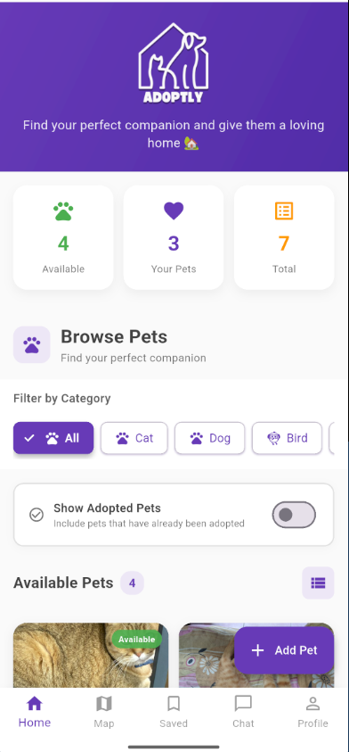 | 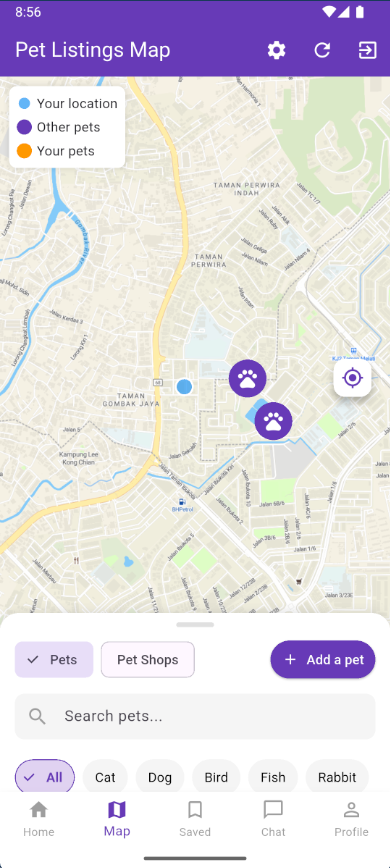 | 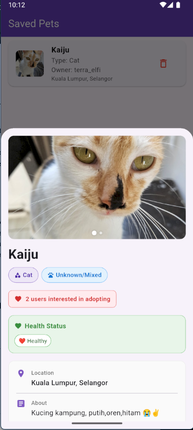 |

### User Features
| Login | Register | Profile |
|:-----:|:--------:|:-------:|
| 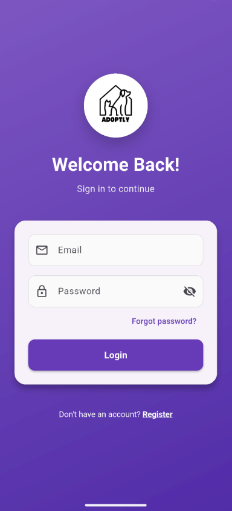 | 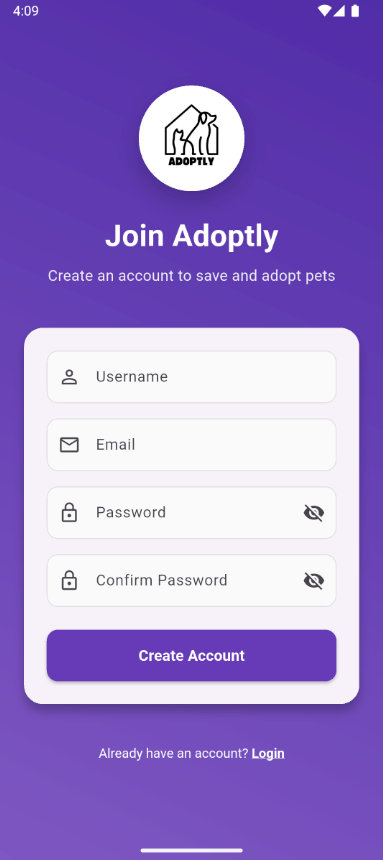 | 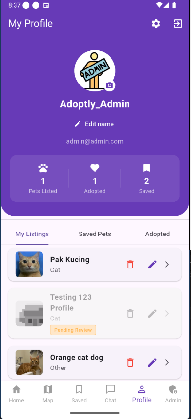 |

### Chat & Social
| Chat List | Chat Screen | Notifications |
|:---------:|:-----------:|:-------------:|
| 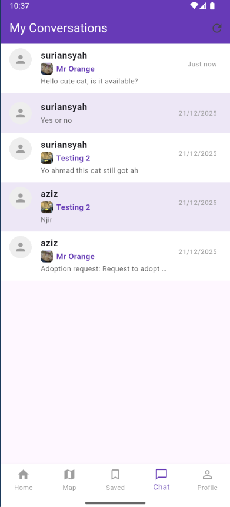 | 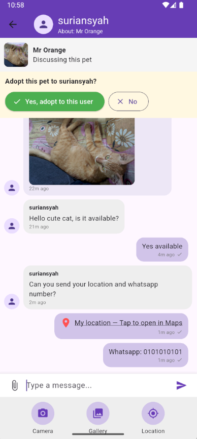 | 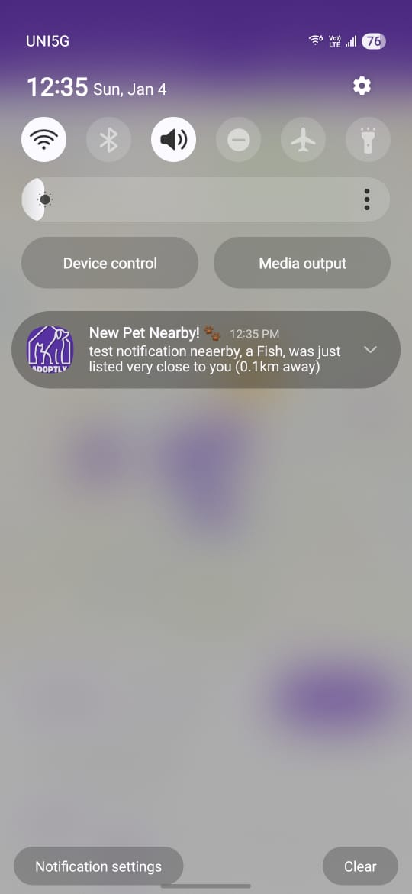 |

### Pet Management
| Add Pet | Saved Pets | Donation |
|:-------:|:----------:|:--------:|
| 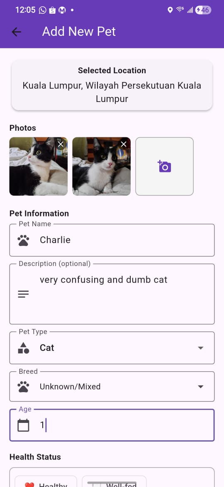 | 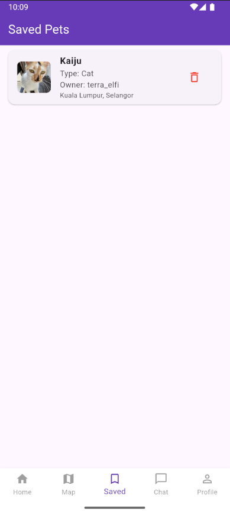 | 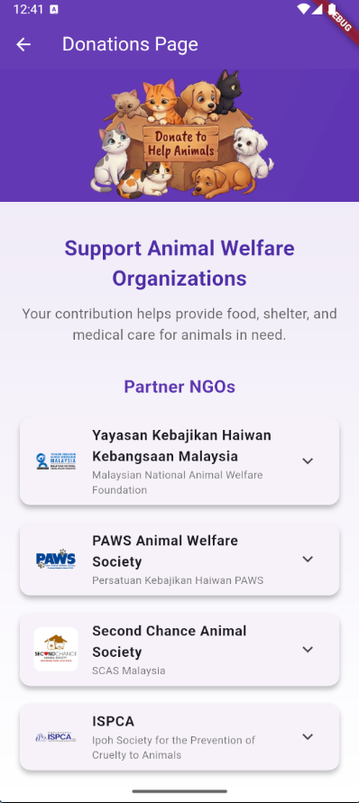 |

### Admin Panel
| Users Management | Pets Management | Pending Review |
|:----------------:|:---------------:|:--------------:|
| 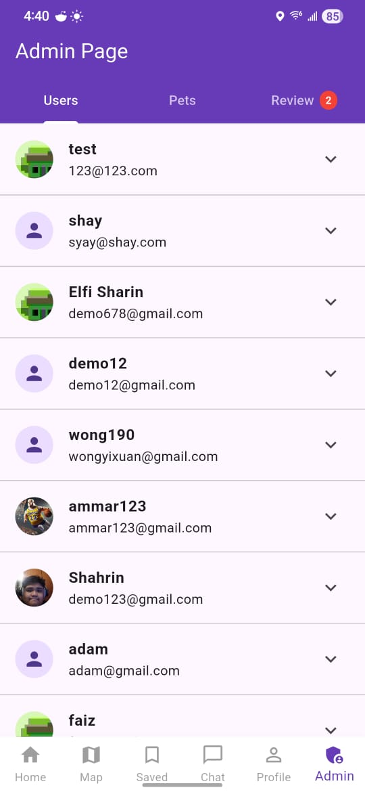 | 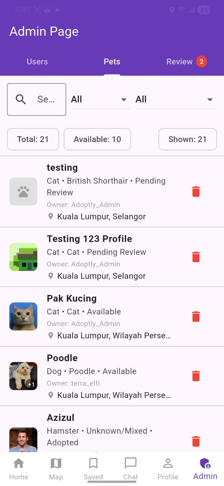 | 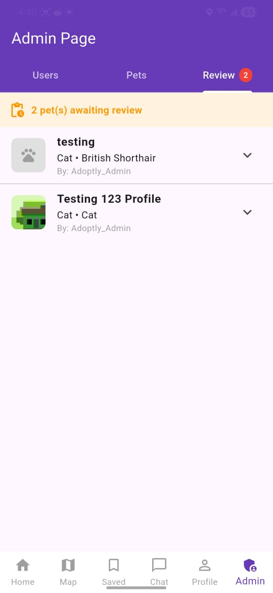 |

---

## 🛠️ Tech Stack

| Category | Technology |
|----------|------------|
| **Framework** | Flutter 3.7+ |
| **Language** | Dart |
| **Backend** | Firebase |
| **Authentication** | Firebase Auth |
| **Database** | Cloud Firestore |
| **Storage** | Firebase Storage, Cloudinary |
| **Maps** | Flutter Map + OpenStreetMap |
| **Notifications** | Firebase Cloud Messaging |
| **Location** | Geolocator, Geocoding |

## 📁 Project Structure

```
lib/
├── main.dart                 # App entry point
├── firebase_options.dart     # Firebase configuration
├── models/                   # Data models
│   └── pet_listing.dart
├── screens/                  # UI screens
│   ├── home_screen.dart
│   ├── map_screen.dart
│   ├── chat_screen.dart
│   ├── profile_screen.dart
│   ├── admin_screen.dart
│   └── map/                  # Map-related widgets
├── services/                 # Business logic
│   ├── auth_service.dart
│   ├── cloudinary_service.dart
│   └── notification_service.dart
└── widgets/                  # Reusable widgets
```

<p align="center">
  Made with ❤️ for pets and their future families
</p>
# adoptly-pet-listing
